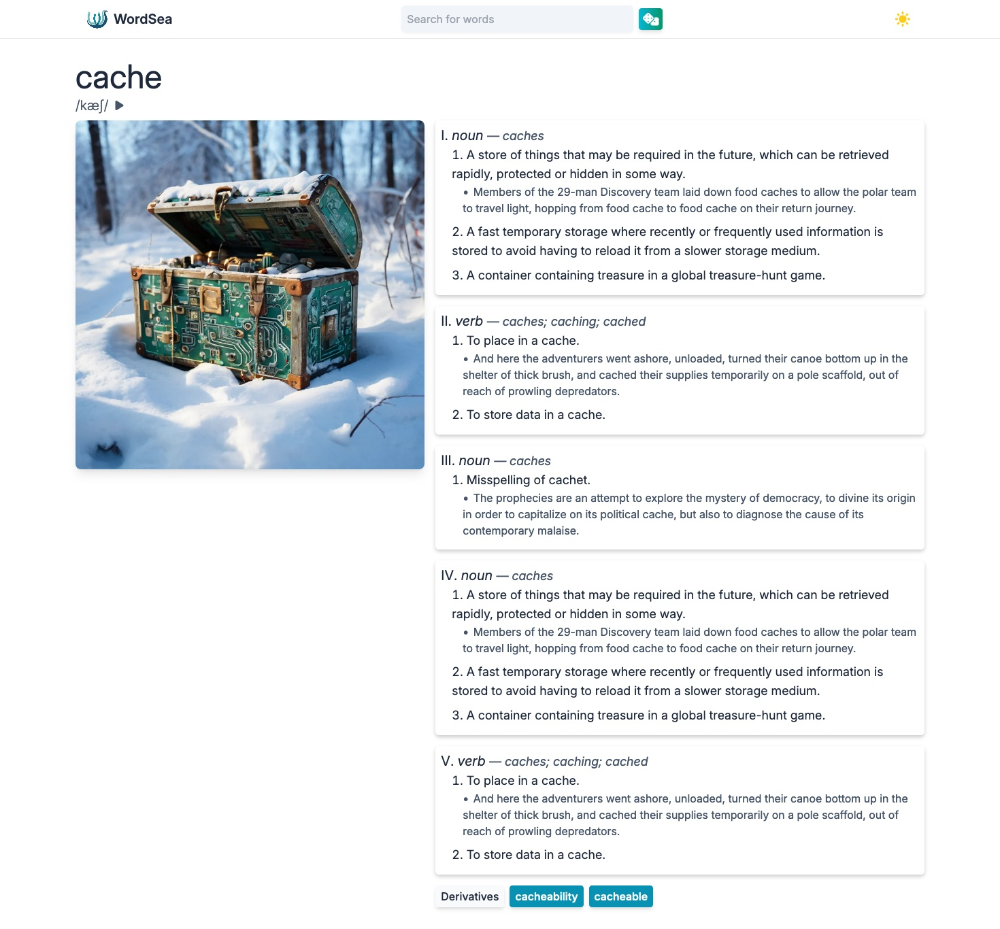
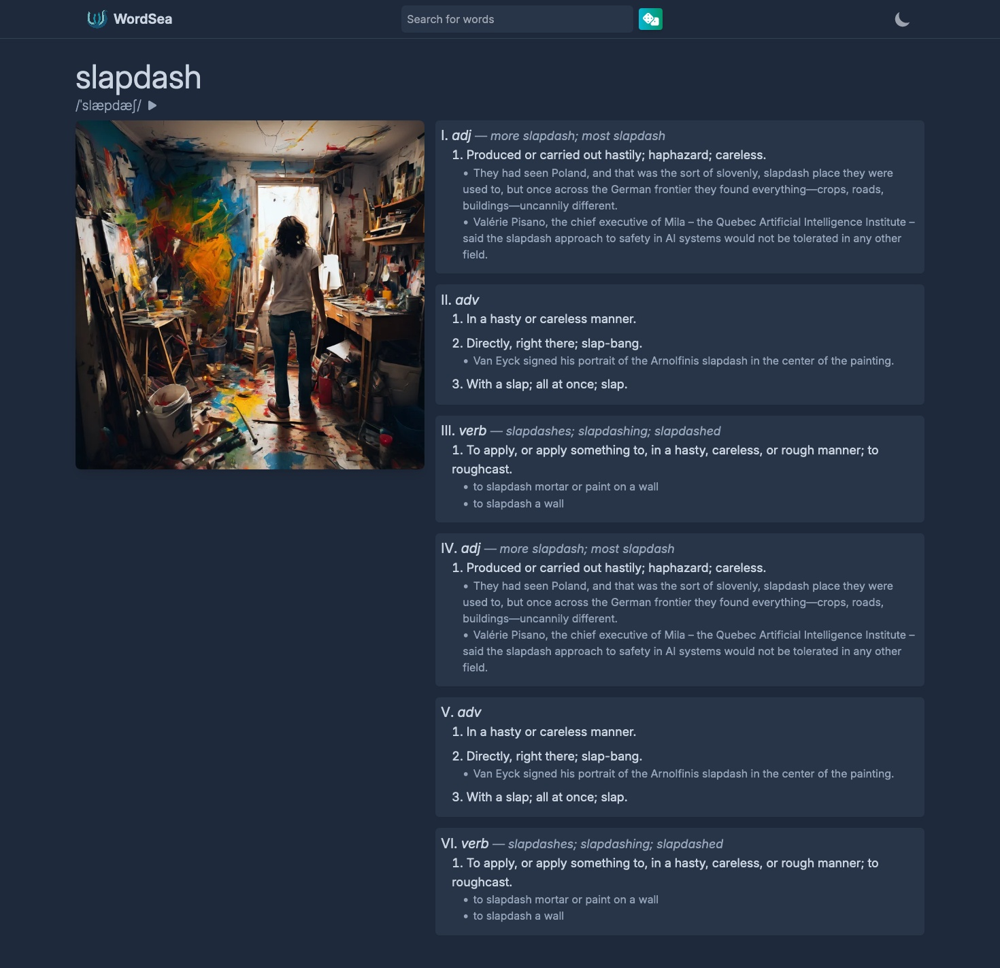
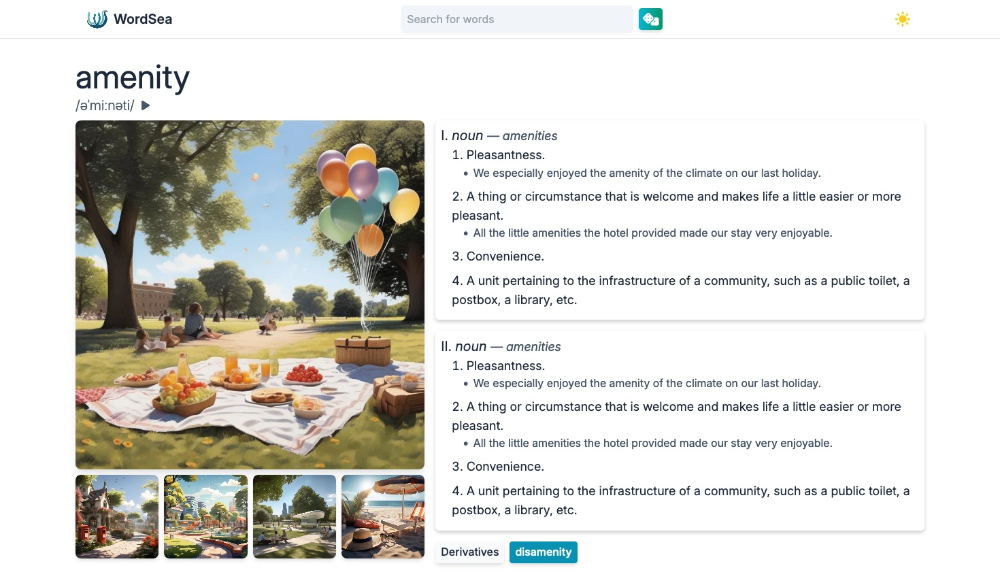

<h1 align="center">
  <a href="https://wordsea.xyz/" target="_blank">
    <picture>
      
    </picture>
  </a>
<p align="center">WordSea</p>
</h1>

<h2 align="center">
  Let written be seen
</h2>

WordSea is a SvelteKit web application designed to enhance English vocabulary. You can check it out and dive into WordSea on [wordsea.xyz](https://wordsea.xyz/).

The core idea is to improve the process of learning new words by employing mnemonic techniques that associate words with their definition-based visualizations.

While some words naturally lend themselves to visual representations (think "apple" or "parachute"), this project's approach addresses the challenge of memorizing abstract concepts (such as "imagine" or "eon"). To accomplish this, we've utilized state-of-the-art LLMs and Text-to-Image models to generate definition-based visual representations of a subset of the English vocabulary. These visualizations are later combined with word definitions, IPA pronunciation, audio recording, and derivative information to create compact word cards, forming comprehensive dictionary entries.

Embark on your journey with WordSea and let the written be seen.

## Setup

If you want to run the application locally, follow the instructions below.

### Prerequisites

- [Docker](https://www.docker.com/)
- [Node.js](https://nodejs.org/en/)

Start by cloning the repository

```bash
git clone https://github.com/Stardust87/wordsea
cd wordsea
```

### Application

```bash
cd app
npm install
cd ..
docker compose up
```

### Database

Data is stored in MongoDB and its dump is available for download [here](https://mega.nz/file/o8kgkZjY#0xBTKQoCT4MPn8-pZ-rsgE2pJj-KDuudvCHe6FMmoew).

Check the container id and restore the dump

```bash
docker exec -i [container_id] mongorestore --gzip --nsInclude="wordsea.*" --archive < [dump_path]
```

## Word cards

<h2 >
    <picture>
      
    </picture>
</h2>
<h2 >
    <picture>
      
    </picture>
</h2>
<h2 >
    <picture>
      
    </picture>
</h2>
